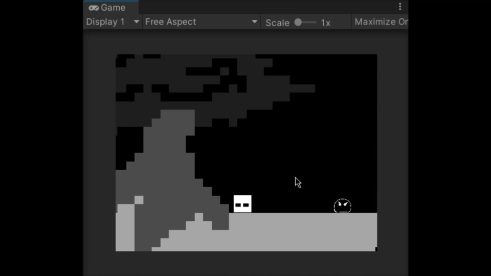

# UnityScript

Unity遊戲製作時常用的Script
[Toc]
## 2D
### Attack
**PlayerStepDownAttack**
Instruction: Player jump into sky and than step on enemy
- variable
    - Jump force(float)
    - Attack force(float)
    - Rigidbody2D(Rigidbody2D)
    - Ground check(transform)
    - Ground Layer(LayerMask)



enemy example:
```csharp=
private void Update()
{
    isDownAttack = GameObject.Find("player").GetComponent<PlayerStepDownAttack>().isDownAttack;

    if (Physics2D.OverlapCircle(m_playerCheck.position, playerRadius, m_playerLayer) && isDownAttack)
    {
        this.gameObject.SetActive(false);
    }
}
```
### Brackeys tutorial
**CharacterController2D**

[From Brackeys](https://github.com/Brackeys/2D-Character-Contro)
- variable
    - Jump force(float)
    - Crouch speed(float)
    - Movement smoothing(float)
    - Air control(bool)
    - What is ground(Layer)
    - Celling check(transform)
    - Ground check(transform)

- function
    - .Move(float move, bool crouch, bool jump)

**PlayerMovement**
- variable
    - Run speed(float)
    - controller(CharacterController2D)

**Cinemachine**  

A package uses to control 2D camera  
Install from: Window->Package Manager->Cinemachine  
[Brackeys Cinemachine Tutorial](https://youtu.be/2jTY11Am0Ig)

## Top Down 2D

**PlayerMovement**
    - Move speed(float)
    - Rigidbody2D(Rigidbody2D)
